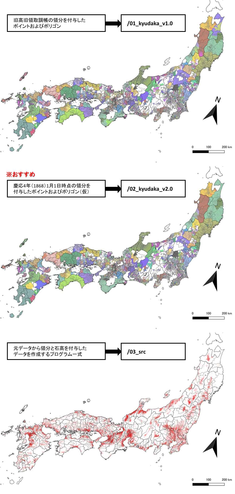
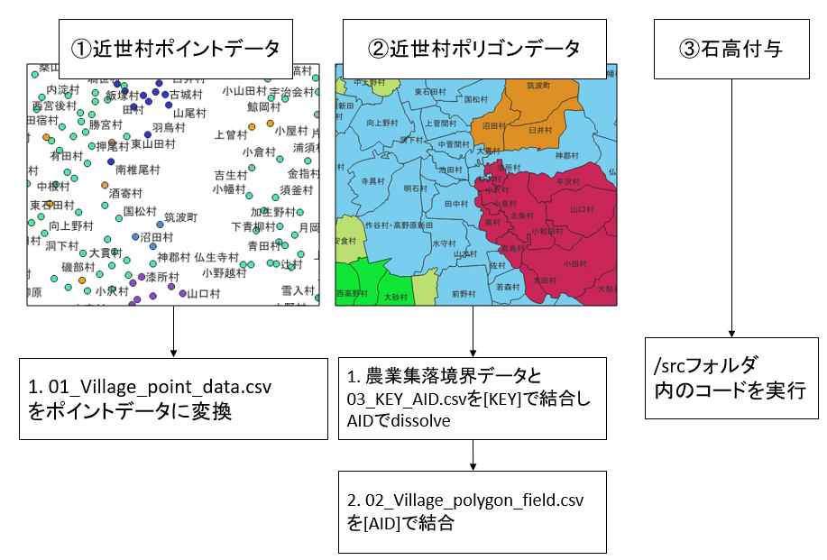

# 幕末期近世村領域データ

　このデータは、幕末期（慶応年間頃）の近世村領域データと点データです。

　旧高旧領取調帳をベースとして天保郷帳、角川日本地名大辞典等から作成した近世村リストと農業集落境界データによって作成しています。
 
　./01_kyudaka_v1.0　は幕末頃の全国の近世村の点データおよび領域データです。付与されている領分は旧高旧領取調帳に従っています。 

　./02_kyudaka_v2.0　はV1.0と同様のデータですが旧高旧領取調帳の領分の誤りを修正し、各種資料から慶応4年1月1日時点の領分を付与した近世村データです。
 
　地図としてご覧になりたい方は./02_kyudaka_v2.0の利用をお勧めします。

 　./03_src　は元データからこれらのデータを作成するソースコード（R、QGISを使用）です。村ごとの石高を付与したい場合はこちらから復元してください。

データは以下の方法で可視化できます。

詳細はそれぞれのフォルダ内のPDFをご覧ください。

## 旧高旧領取調帳

　主な出典としている旧高旧領取調帳データベースは、木村礎氏（明治大学教授）の校訂により近藤出版社から刊行された日本史料選書のうちの「旧高旧領取調帳」全6冊を原データとして、歴博の歴史研究部と情報資料研究部が共同で作成されたものです。

https://www.rekihaku.ac.jp/doc/t-db-index.html

国立歴史民俗博物館データベース[利用規程](https://www.rekihaku.ac.jp/doc/db_kitei.pdf)に従って下さい。

## 農業集落境界データ（農林業センサス2015版）

　当データを作成するためには農業集落境界データが必要です。
 
　農業集落境界データは、農林水産省が5年毎に行っている農林業センサスで用いられている調査単位であり、農林水産省から公開されているshapeデータです。

[地域の農業を見て・知って・活かすDB](https://www.maff.go.jp/j/tokei/census/shuraku_data/2015/index.html)で公開されています。

・「地域の農業を見て・知って・活かすDB」は、どなたでも複製、公衆送信、翻訳・変換等の翻案等、自由に利用できます。

・「地域の農業を見て・知って・活かすDB」を利用する際は、出典を明示してください。また、「地域の農業を見て・知って・活かすDB」を編集加工して利用する場合は、編集・加工者も明示してください。

・「地域の農業を見て・知って・活かすDB」の利用目的及び利用方法については、利用者の判断と責任に委ねられており、農林水産省は一切関与いたしません。

・事由の如何を問わず、「地域の農業を見て・知って・活かすDB」を利用することにより生じた利用者又は第三者の損害については、利用者がそのすべての責任を負うものとし、農林水産省は一切の責任を負いません。

## ライセンス

[CC BY-SA 4.0](https://creativecommons.org/licenses/by-sa/4.0/deed.ja)

## 出典

[本田 謙一, 夏目 宗幸, 根元 裕樹，旧高旧領取調帳と農業集落境界データによる近世村領域推定，地理情報システム学会講演論文集(CD-ROM) ,31巻, P-20.](https://www.gisa-japan.org/content/files/conferences/proceedings/2022cd/papers/P-20.pdf)

## 履歴

2024/4/13 公開
